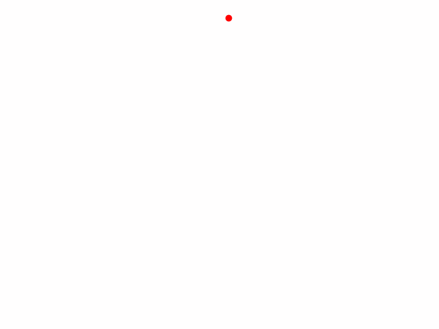

# QuickDraw-Doodler
Final Project for ECS 271 Machine Learning and Discovery at UC Davis. Project will be able to generate learned doodles in the way humans are able to, as well as classify various doodles from other people. Both using Google's [QuickDraw! Dataset](https://github.com/googlecreativelab/quickdraw-dataset).

## Project Goal
Google has already trained a Sequence2Sequence Variational Autoencoder for this dataset. However they only fed the spatial dimensions and binary pen state of the stroke sequences (dx, dy, and p), even though the dataset recorded the time of the strokes and individual stroke progression (dt). The goal of this project is to incorporate the timing of these sketches. Capturing the temporal aspect as well as spatial. This allows us to not only model the pathing that humans draw sketches, but also learn the time variation between and within strokes. 


<p align="center">
  
  
</p>


These gifs are both from the same dataset (not generated). Here you can see how Google's model (left/top) would receive the data. Where all strokes are constant speeds, and therre is no pause in between strokes where a human would normally have to lift there pen and move it to continue the sketch. Our model (right/bottom) receives the pen strokes as a vector including the time deltas along with the spatial ones. Our model is designed to learn both of these aspects of how humans draw, and generate as such.

---

# Using The Project
## CLI Arguments

Below are descriptions of the main command-line arguments for the `main.py` script.

- `-m, --mode`
  (Required, default: train)
  Specifies the operation mode. Choices are:
    * train: Download and prepare data, then train a model on the specified dataset.
    * generate: Use a trained model to generate new doodles. Requires `--model_path`.
    * infer: Perform inference/classification on input doodles. Requires `--model_path`.
  
- `-dm, --data_mode`
  (Default: full)
  Specifies the type of data used for training (and associated modes):
    * full: Full stroke-based data from the raw dataset (x, y, t sequences).
    * simplified: 255x255 rasterized doodle images (no timing data).
    * reduced: 28x28 downsampled and antialiased doodle images.
  
- `-nspc, --num_samples_per_class`
  (Default: 10000)
  Sets the number of samples to use per class for training or evaluation.
  
- `-mt, --model_type`
  (Default: RNN)
  Specifies the type of model architecture. Choices can include:
    * RNN: Recurrent neural network-based model (e.g., LSTM, GRU).
    * CNN: Convolutional neural network-based model (for image-based modes).
  
- `-mp, --model_path`
  Path to a saved, trained model checkpoint. Required when using `--mode generate` or `--mode infer`.
  
- `-l, --label`
  Optional label/class name to condition generation on. Must be one of the classes the model was trained on.

## Example Commands

- Download and prepare training data (10,000 samples per class) using simplified images:
`python main.py -m train -dm simplified -nspc 10000`
`python main.py --mode train --data_mode simplified --num_samples_per_class 10000`


- Download and prepare training data for rnn generation (50,000 samples per class) using full stroke-based data:
`python main.py -m train -dm full -mt rnn -nspc 50000`
`python main.py --mode train --data_mode full --model_type rnn --num_samples_per_class 50000`

Once training is complete, you can generate new doodles or perform inference using trained models:
- Generate doodles with a trained model (model path required):
`python main.py -m generate -mt rnn -mp path/to/trained_model.pt`

- Generate doodles conditioned on a label (model path required):
`python main.py -m generate -mt rnn -l cat -mp path/to/trained_model.pt`

- Classify/infer on a doodle with a trained model (model path required):
`python main.py -m infer -mt cnn -mp path/to/trained_model.pt`

## Data Structure
1. **full**: Used for the generator, this comes from the raw dataset and once downloaded will contain the x, y, and t values of strokes taken for doodles. These are converted into (sequence_len, 4) vectors and all normalized and converted to relative position/time (deltas) instead of global. Additionally we had a binary pen state where `0` indicates the pen is lifted (i.e. moving to new location without drawing) and `1` indicates pen is down and drawing.
    
    ```

    ORIGINAL sample stroke data:
    [ 
        [  // First stroke 
            [x0, x1, x2, x3, ...],
            [y0, y1, y2, y3, ...],
            [t0, t1, t2, t3, ...]
        ],
        [  // Second stroke
            [x0, x1, x2, x3, ...],
            [y0, y1, y2, y3, ...],
            [t0, t1, t2, t3, ...]
        ],
        ... // Additional strokes
    ]

    POST-PROCESSED sample stroke data:
    [
        [0      0      0      1],
        [dx1    dy1    dt1    p1],
        [dx2    dy2    dt2    p2],
        [dx3    dy3    dt3    p3],
        ...
        [dxn    dyn    dtn    pn]
    ]
    n = sequence length

    ```
    
2. **Simplified**: Data originally comes in vector coordinate x, y pairs, and the time values are removed. When saving the .npy the vectors are rasterized into 2D arrays representing the 255x255 images of the doodles. Normalized pixel values between 0 and 1.

3. **Reduced**: Same as simplified, but the dimensions of the image are reduced down to 28x28 and antialiasing is applied to better represent the original image.

- `config/subset_classes.json` is where we specify the list of classes used for each of the 3 modes, since using all 354 classes would be insane for a class project. 
- `config/model_params.json` is where we specify the dict of hyperparameters for the RNN and CNN. 


---


## vae WIP

- [x] weight inits
  - [x] fc layer xavier-glorot
  - [x] lstm in to hidden xavier-glorot
  - [x] lstm hidden to hidden orthogonal

- [x] remove label conditions
  - (label args still remain for later updates)
- [x] remove attention bullshit
- [x] encoder pack padded sequences
- [x] handle SOS/EOS tokens in training
- [x] check kl loss
- [ ] check recon loss
- [ ] check mdn layers
  - fc layer may be missing
- [ ] add correct recurrent dropout
- [ ] layer norm - decoder?
- [ ] WEIGHT P VALUES